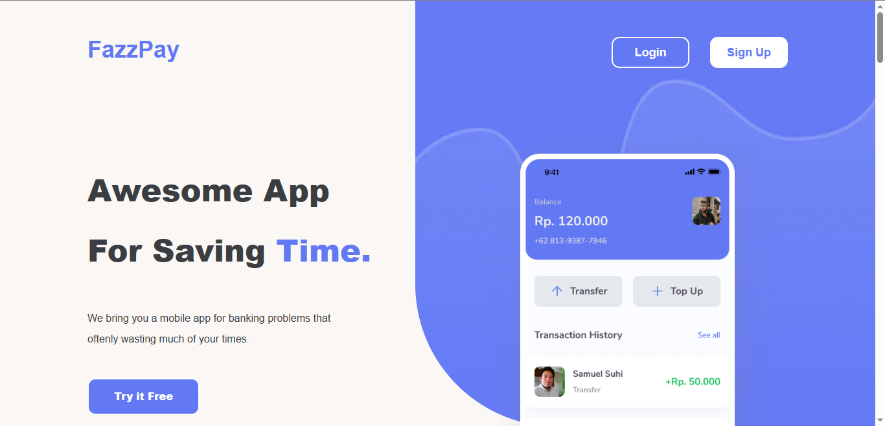

## Readme Top

<div align="center">

<h3 align="center">Fazzpay Project</h3>

  <p align="center">
    <a href="https://fazzpay-ecru.vercel.app">View Demo</a>
    ·
    <a href="https://github.com/redhadefinto/fazzpay/issues">Report Bug</a>
    ·
    <a href="https://github.com/redhadefinto/fazzpay/pulls">Request Feature</a>
  </p>
</div>

<!-- TABLE OF CONTENTS -->
<details>
  <summary>Table of Contents</summary>
  <ol>
    <li>
      <a href="#about-the-project">About The Project</a>
      <ul>
        <li><a href="#built-with">Built With</a></li>
      </ul>
    </li>
    <li>
      <a href="#getting-started">Getting Started</a>
    </li>
    <li><a href="#usage">Usage</a></li>
    <li><a href="#contact">Contact</a></li>
    <li><a href="#acknowledgments">Acknowledgments</a></li>
    <li><a href="#license">License</a></li>
  </ol>
</details>

<!-- ABOUT THE PROJECT -->

## About The Project

<!-- ![Product Name Screen Shot][product-screenshot] -->

FazzPay is a cutting-edge digital wallet application that revolutionizes the way people make payments, transfers, and manage their finances. Designed with user convenience and security in mind, FazzPay offers a seamless and hassle-free experience

<p align="right">(<a href="#readme-top">back to top</a>)</p>

### Built With

- [![Next][Next.js]][Next-url]
- [![Tailwind][Tailwind-CSS]][Tailwind-url]
- [![Redux][Redux]][Redux-url]

<p align="right">(<a href="#readme-top">back to top</a>)</p>

<!-- GETTING STARTED -->

## Getting Started

1. Clone the repo
   ```sh
   git clone https://github.com/redhadefinto/fazzpay.git
   ```
2. Install NPM packages
   ```sh
   npm install
   ```
3. Run dev local
   ```sh
   npm run dev
   ```
4. Open Browser
   ```sh
   http://localhost:3000
   ```

<p align="right">(<a href="#readme-top">back to top</a>)</p>

<!-- USAGE EXAMPLES -->

## Usage

- Register Account and Check your email for verification (Problem with register)
- For verify just see message when open the link to look is success or not
- Edit your profile (Image, Phone Number)
- Top up
  - Select amount you want to top up
  - Select payment just select BCA Klikpay => Pay now => Bayar => success (Dont worry this is just test not actual)
- Transfer
  - Select person you want to transfer
  - Type amount and note
  - Continue => enter pin => success

<p align="right">(<a href="#readme-top">back to top</a>)</p>

## Deployment

Project Link: [here](https://fazzpay-ecru.vercel.app/)

<p align="right">(<a href="#readme-top">back to top</a>)</p>

## Documentation

<div>
  
  
</div>
<div>
  
  
</div>


<p align="right">(<a href="#readme-top">back to top</a>)</p>

<!-- CONTACT -->

## Contact

Redha Definto - redhadefinto28@gmail.com

<p align="right">(<a href="#readme-top">back to top</a>)</p>

<!-- Contributor -->

## Contributor

  <table>
    <tr>
      <td >
        <a href="https://github.com/redhadefinto">
          <br/>
          <center><sub><b>Redha Definto </b></sub></center>
        </a>
        </td>
    </tr>
  </table>
<h1 align="center"> THANK FOR YOUR ATTENTION </h1>

<!-- MARKDOWN LINKS & IMAGES -->
<!-- https://www.markdownguide.org/basic-syntax/#reference-style-links -->

<!-- [product-screenshot]: index.png -->

[Next.js]: https://img.shields.io/badge/next.js-000000?style=for-the-badge&logo=nextdotjs&logoColor=white
[Next-url]: https://nextjs.org/
[React.js]: https://img.shields.io/badge/React-20232A?style=for-the-badge&logo=react&logoColor=61DAFB
[React-url]: https://reactjs.org/
[Tailwind-CSS]: https://img.shields.io/badge/tailwindcss-%2338B2AC.svg?style=for-the-badge&logo=tailwind-css&logoColor=white
[Tailwind-url]: https://tailwindcss.com/
[Redux]: https://img.shields.io/badge/redux-%23593d88.svg?style=for-the-badge&logo=redux&logoColor=white
[Redux-url]: https://redux.js.org/
